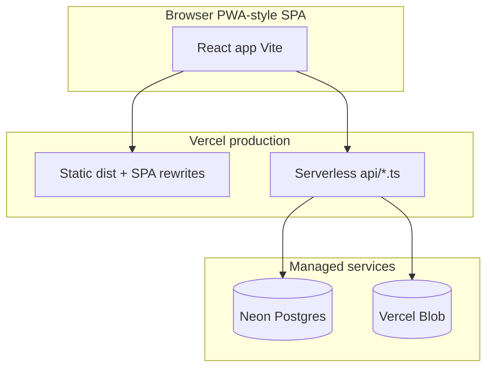

# POC framework: Jalsa 2026 Fire & Safety web app

This document frames what the **proof of concept** is today, how it is built and deployed, and where **future wishes** can be captured and prioritised. Use it as a shared map before debating features.

---

## 1. What the POC is for

| Aspect | POC intent |
|--------|------------|
| **Audience** | Fire & safety volunteers / duty holders at the event, mainly on phones |
| **Goal** | Show a **minimal working path**: sign in, see static reference (team, rota, help, roles), **report** an incident, **browse** the log, see the **map**, export data where implemented |
| **Explicit non-goals (so far)** | Full IAM, audit-grade security, multi-tenant ops, live roster sync with external systems (unless you add them later) |

The **presentation deck** under [`presentation/`](../presentation/) is a walkthrough of the same scope for stakeholders.

---

## 2. System shape (high level)

**Local dev:** Vite serves the UI; [`scripts/local-api.ts`](../scripts/local-api.ts) mimics the same `/api` routes on port 3000 with `.env.local`.

---

## 3. Capabilities map: what exists today

Rough split so we can talk about **done**, **thin POC**, and **wish**.

| Area | In repo today | Notes |
|------|----------------|-------|
| **Auth** | Single shared password, JWT session cookie | Hard-coded POC password; not user accounts |
| **Team / Rota** | Pages + data files | [`src/data/team.ts`](../src/data/team.ts), [`src/data/rota.ts`](../src/data/rota.ts): placeholders until real data |
| **Help / Roles** | Pages + data files | [`src/data/help.ts`](../src/data/help.ts), [`src/data/dutyRoles.ts`](../src/data/dutyRoles.ts) |
| **Report incident** | Form, validation (Zod), draft + submit API | Images via Blob when configured |
| **Incident log** | List, search/filter UI, links to photos | Backed by Postgres |
| **Map** | Leaflet, venue-centred | Static centre; not live asset tracking |
| **CSV** | Export from API / UI patterns | See README for cron snapshot option |
| **Deploy** | `vercel.json`, Neon, optional Blob | Env-driven |

Routes (for traceability): `/login`, `/`, `/rota`, `/incidents`, `/incidents/log`, `/map`, `/help`, `/roles` ([`src/App.tsx`](../src/App.tsx)).

---

## 4. Minimal working example (MWE) checklist

Use this to confirm “we can demo the POC” end to end:

1. **Environment:** `SESSION_SECRET`, Postgres URL, and (if testing uploads) `BLOB_READ_WRITE_TOKEN` set where you run the API.
2. **Sign in** with the POC password.
3. **Open** Team, Rota, Help, Roles: content renders from bundled data.
4. **Submit** a test incident (with or without images).
5. **Open** Log: incident appears; search/filter behaves sanely.
6. **Open** Map: tiles and marker load.
7. **Optional:** CSV export / cron behaviour per your deployment.

If all of the above pass, the **MWE is intact**; everything else is enhancement or operations hardening.

---

## 5. Wishlist (parking lot)

Items you want **are not ordered** here. During a feature chat, move each line into **Now / Next / Later** or **Must / Should / Could**.

Paste or edit bullets below (or link to an issue list).

- *(Your wish 1)*
- *(Your wish 2)*
- *(Your wish 3)*

**Suggestion buckets** (optional labels when you prioritise):

- **Data:** Real rota import, replacing placeholders, CMS vs git-based copy  
- **Auth & roles:** Named users, role-based pages, SSO  
- **Incidents:** Workflow states, assignments, notifications, offline queue  
- **Observability:** Audit log, richer exports, dashboards  
- **Map / site:** Layers, indoor plans, pins from incidents  
- **Ops:** Runbooks, backups, DR, penetration test fixes  

---

## 6. How to discuss features from here

1. **Confirm MWE** (section 4) still passes after any change.  
2. **Pick one wish** from section 5 (or add it).  
3. For each wish, briefly note: **user story**, **depends on** (DB/API/UI), **risk**, **POC vs production**.  
4. Track decisions in PR descriptions or issues so the deck and this file stay aligned when you update them.

---

## Related docs

- [README.md](../README.md)  
- [DEVELOPER.md](../DEVELOPER.md)  
- [presentation/README.md](../presentation/README.md)
