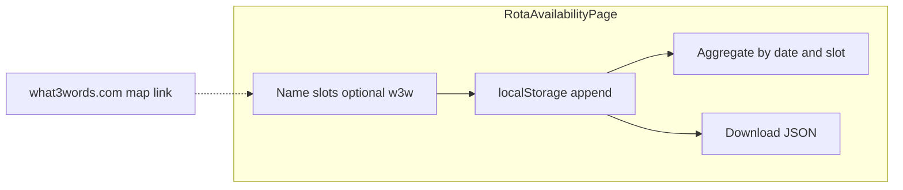

# Rota availability page (rota maker) — plan

**Planned route:** `/rota/availability` (protected, inside `AppLayout`)  
**Planned source:** `src/pages/RotaAvailabilityPage.tsx`  
**Feature toggle:** `src/config/features.ts` → `ENABLE_ROTA_AVAILABILITY_PAGE` (set `false` to hide route + nav; or comment out the marked blocks in `App.tsx` / `AppLayout.tsx`)  
**Data (planned):** `src/data/rotaAvailability.ts` — slot ids + labels; reuse `JALSA_DAYS` / `jalsaDaySelectLabel` from `src/model/incident.ts`  
**Related:** Read-only duty grid stays on `src/pages/RotaPage.tsx` + `src/data/rota.ts`.

## Documentation outcome (two READMEs + PM alignment)

The feature should land with **two** engineering markdown docs, **aligned with product-manager (PM) documentation**, and kept consistent with existing stakeholder materials in this repo.

### Engineering docs (two files)

| File | Role |
|------|------|
| [`plan/RotaAvailabilityPage.md`](RotaAvailabilityPage.md) | **Plan + spec** — toggle, shift model, what3words rules, persistence shape, removal, checklist, diagrams. Stays in `plan/` as the source of truth for *what we intended* and how to disable/delete the feature. |
| [`readme_page/RotaAvailabilityPage.md`](../readme_page/RotaAvailabilityPage.md) | **Built-page reference** — same pattern as [`readme_page/IncidentLogPage.md`](../readme_page/IncidentLogPage.md) / [`LoginPage.md`](../readme_page/LoginPage.md): route, source files, feature flag, purpose, UI control tables, `localStorage` key, export, errors. Updated when code exists so it documents *what shipped*. |

### PM / product documentation

| Expectation | Detail |
|-------------|--------|
| **Source of truth** | Use the PM’s **proper** product artefacts (PRD, user stories, acceptance criteria, stakeholder brief, or equivalent) as the authority for **user-facing scope**, **copy**, and **acceptance**. This plan and the two READMEs must **not contradict** those artefacts; where engineering needs to simplify for POC, record the gap explicitly in the plan (e.g. “POC defers X per PM doc §…”). |
| **Traceability** | In [`plan/RotaAvailabilityPage.md`](RotaAvailabilityPage.md), add a short **“PM references”** subsection (when known): links or paths to the PM doc(s), section IDs, ticket IDs, or deck version — so reviewers can verify alignment. |
| **`readme_page` tone** | The built-page readme should use **user- and operator-aligned language** consistent with PM docs (field labels, shift names, event naming), not only internal jargon. |
| **Repo stakeholder docs** | Keep this feature consistent with [`docs/POC-FRAMEWORK.md`](../docs/POC-FRAMEWORK.md) (POC scope and audience). If the rota maker changes POC intent, update that framework **and** any capped narrative in [`presentation/`](../presentation/) that stakeholders rely on, in line with PM sign-off. |

When implementing: finish the code, then ensure **both** engineering READMEs are accurate; **reconcile with PM documentation** and update POC/presentation docs if scope or messaging changed.

### PM references (fill when PM artefact is available)

- *Example:* PRD / Notion / ticket link, document version, sections covering rota capture, geotagging, or Jalsa ops language.
- *Until linked:* Treat [`docs/POC-FRAMEWORK.md`](../docs/POC-FRAMEWORK.md) and the [`presentation/`](../presentation/) deck as the in-repo stakeholder baseline.

## Purpose

Collect **per-person availability** for the **Jalsa weekend POC** (same dates as `JALSA_DAYS`: 24–26 July 2026). One submission = one person: name plus which **date + shift** blocks they can do. Optionally capture a **what3words** geotag so organisers know *where* on site someone is basing availability from (or their usual rally point). Submissions are stored **client-side** for the POC; show an **aggregate** (who is available per slot) and **export JSON** for organisers.

## Shift model

| Slot | Hours |
|------|--------|
| Morning | `08:00–14:00` (6 h) |
| Afternoon | `14:00–20:00` (6 h) |
| Night | `20:00–08:00` (12 h, into **next calendar day** — label clearly, e.g. “Friday night — 20:00 Fri → 08:00 Sat”) |

For each Jalsa day, the form offers **two day checkboxes + one night checkbox** (three per day).

## Geotagging (what3words)

Uses **[what3words](https://what3words.com/)** — the service that gives every 3 m square a unique **three-word** address.

**Goal:** Let each submission optionally include a human-readable **3-word address** (standard format, e.g. `///filled.count.soap` or `filled.count.soap`).

| Area | Behaviour (POC) |
|------|------------------|
| **Field** | Optional text input, labelled clearly (e.g. “what3words address (optional)”). |
| **Help** | Short copy + **link** to [what3words.com](https://what3words.com/) (opens in new tab) so people can look up or verify their square on the map. |
| **Normalisation** | Trim whitespace; strip a leading `///` if present; store one canonical string (e.g. lowercase `word.word.word` for display/export consistency). |
| **Validation** | Light client check only: three dot-separated “word” segments matching what3words’ published character set (letters, no spaces in a segment) — **no API call required** for the POC. If invalid, show inline hint; still allow submit **without** a geotag. |
| **Privacy** | Treat as optional; explain in helper text that it pins a map square (rough position). |

**Out of scope for first POC (unless you add an API key later):** Calling [what3words API](https://developer.what3words.com/) for convert/autosuggest — keeps the build free of secrets and avoids quota setup.

## Form behaviour (POC)

| Area | Behaviour |
|------|------------|
| **Name** | Required text. |
| **what3words** | Optional; see **Geotagging (what3words)** section above. |
| **Per-day slots** | Checkboxes per day for morning, afternoon, night. |
| **Submit** | Requires at least one slot; inline error if none. If what3words is non-empty but fails format check, block submit with a clear message. |
| **Persistence** | Append to `localStorage` under a namespaced key (e.g. `fire-safety-rota-availability`): `id`, `submittedAt` (ISO), `name`, `what3words` (string \| null), structured `slots` (date + slot id). |
| **After submit** | Success message; optional reset to add another person on the same device. |
| **Summary** | Below form: for each date + slot, list names from all submissions on this browser; include each person’s **what3words** next to their name when present (or a per-person line under the slot-group). |
| **Export** | Button to download all submissions as JSON. |

## Implementation notes

- **Routing:** Register `<Route path="rota/availability" element={…} />` only when `ENABLE_ROTA_AVAILABILITY_PAGE` is true (`src/App.tsx`).
- **Nav:** Add item near “Rota” (e.g. “Availability” or “Rota maker”) only when flag is true (`src/components/AppLayout.tsx`). Group lines with `ROTA_AVAILABILITY_PAGE` comments for easy manual comment-out.
- **UI:** Match Tailwind patterns used on `RotaPage` / `ReportIncidentPage` (`rounded-xl`, borders, `space-y-*`, alert region).
- **Geotag UI:** Helper link to [what3words.com](https://what3words.com/) with `rel="noopener noreferrer"`; optional “Open map” pattern is just that external link (no embedded map required for POC).

## Removal / disabling

| Action | What to do |
|--------|------------|
| **Hide without deleting code** | Set `ENABLE_ROTA_AVAILABILITY_PAGE` to `false` in `src/config/features.ts`. |
| **Comment out** | Comment the gated route block and nav entry (marked sections). |
| **Delete feature** | Remove the page file, optional `rotaAvailability` data module, `features` export if unused, route, nav wiring, and **`readme_page/RotaAvailabilityPage.md`**; keep or archive `plan/RotaAvailabilityPage.md` only if you still want the historical spec. |

## Optional follow-up (out of scope until requested)

- API + DB for multi-device pooled submissions (similar to incidents).
- “Clear all” for local POC data.

## Implementation checklist

- [ ] **Docs:** Add or refresh [`readme_page/RotaAvailabilityPage.md`](../readme_page/RotaAvailabilityPage.md) (built-page readme). Keep this [`plan/RotaAvailabilityPage.md`](RotaAvailabilityPage.md) in sync if behaviour changes during build. Add **PM references** (paths/links to PM doc, sections, or tickets). Align copy and behaviour with PM acceptance criteria; update [`docs/POC-FRAMEWORK.md`](../docs/POC-FRAMEWORK.md) / [`presentation/`](../presentation/) if POC scope or stakeholder messaging changes per PM.
- [ ] Add `src/config/features.ts` with `ENABLE_ROTA_AVAILABILITY_PAGE`.
- [ ] Add `src/data/rotaAvailability.ts` (types + slot definitions).
- [ ] Implement `src/pages/RotaAvailabilityPage.tsx` (form **+ optional what3words** with normalisation/regex validation, storage, summary showing geotags, export).
- [ ] Optional tiny helper `src/lib/what3words-format.ts` (normalise + validate) if logic exceeds a few lines.
- [ ] Wire conditional route in `src/App.tsx` and nav in `src/components/AppLayout.tsx`.
- [ ] (Optional) Minimal test: empty vs valid submit.

## Flow (high level)

