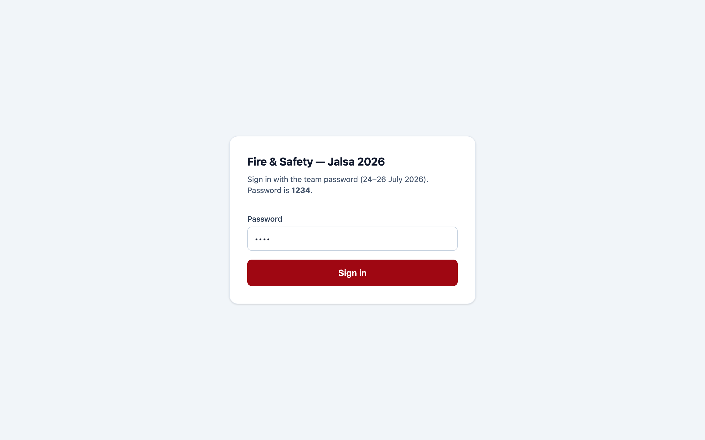
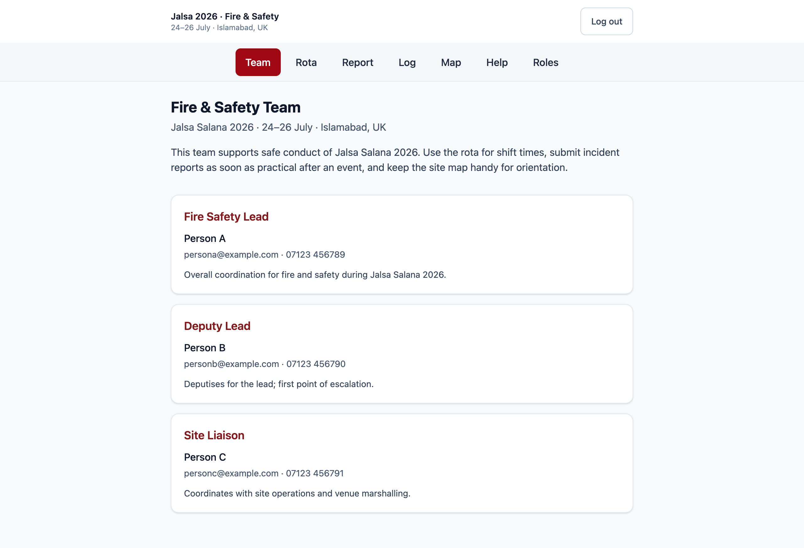
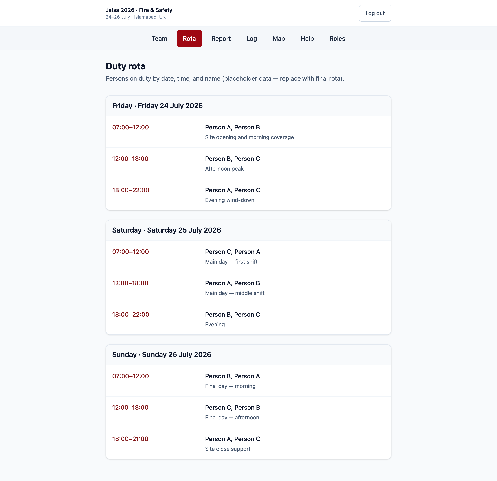
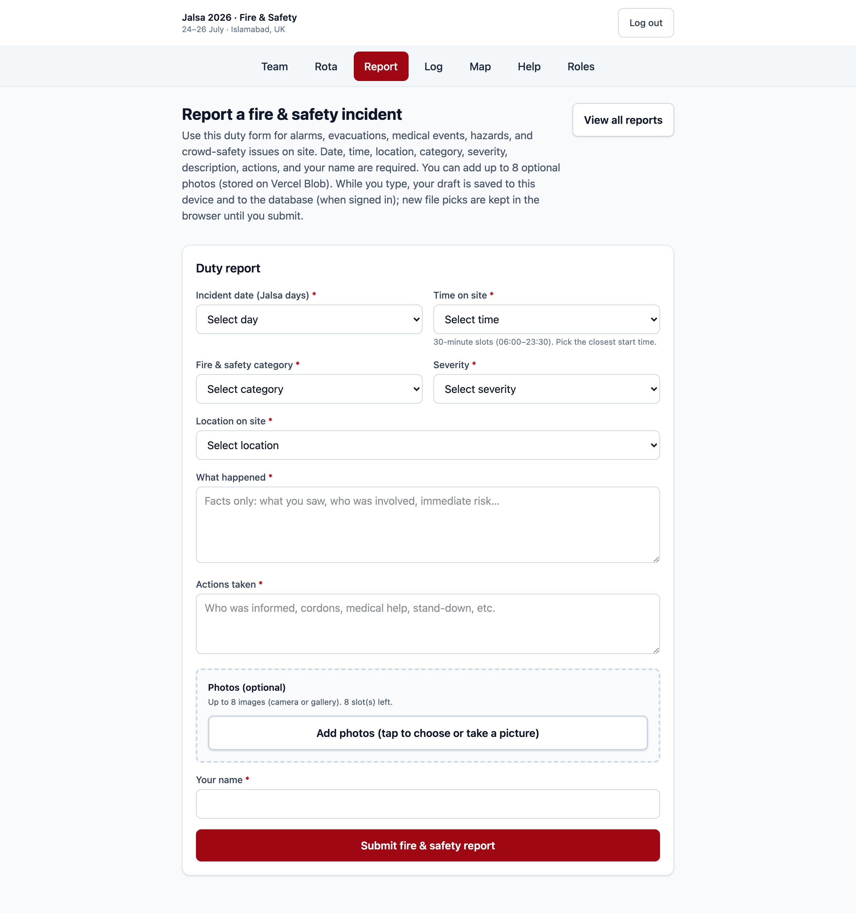
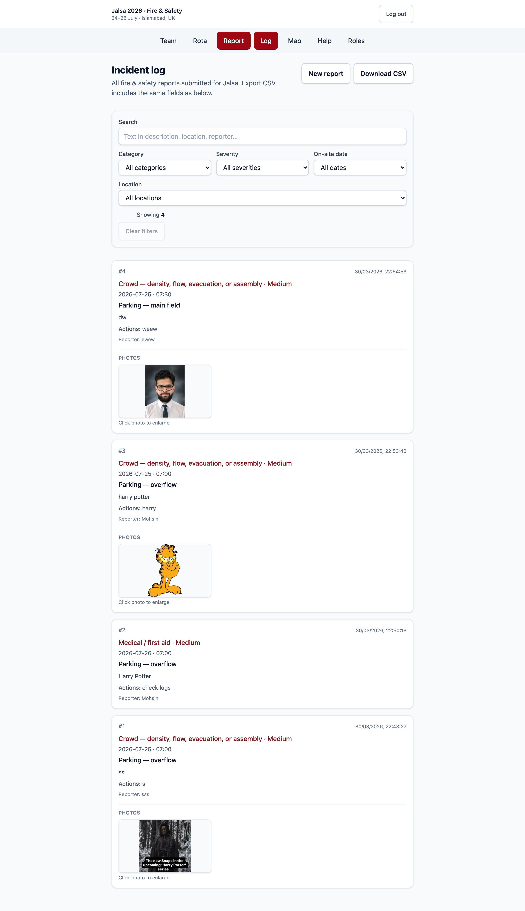
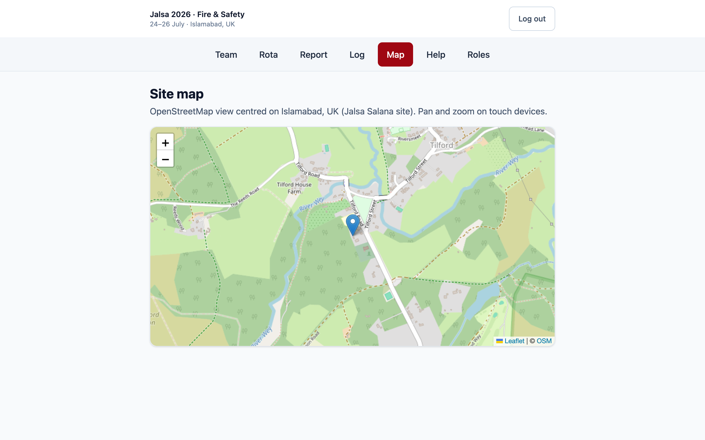
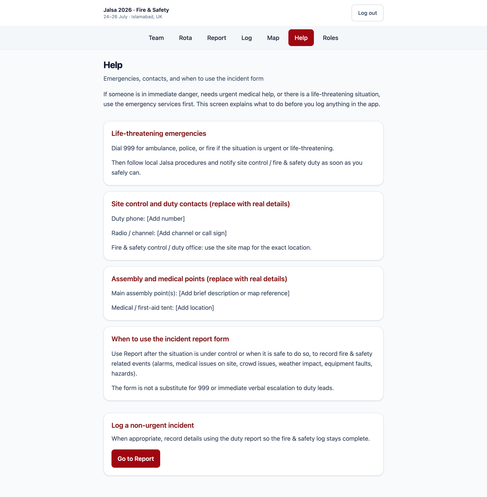
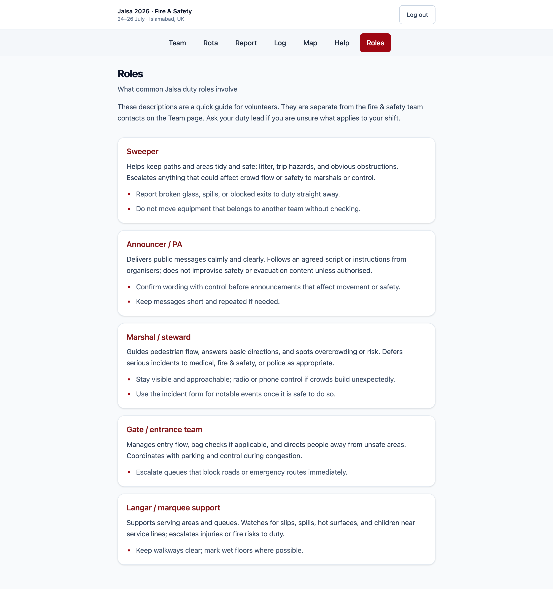
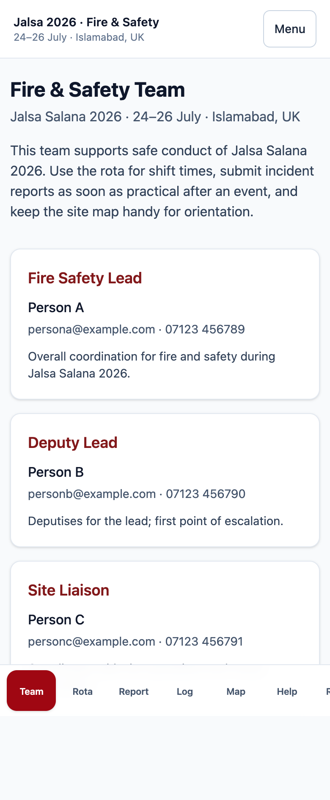

# Jalsa 2026 · Fire & Safety

**Web app walkthrough** · Proof of concept

24–26 July · Islamabad, UK

---

## What this app is

- **On-site coordination** for fire and safety during the event
- **Mobile-friendly** layout: header nav on desktop, bottom tabs on phones
- **Password login** (POC), then: team info, rota, **report / log** incidents, venue **map**, **help** and **role** reference

---

## Login (`/login`)

- Shared **POC password**; login sets a **session cookie**
- After sign-in, user lands on **Team** (or the page they tried to open)

---

## Team (`/`)

- **Roster cards**: role, name, contact, notes
- Main **who to call** view right after login

---

## Rota (`/rota`)

- **Duty rota** by day and time slot
- Placeholder data until the **final schedule** is loaded

---

## Report incident (`/incidents`)

- **Form:** type, severity, location, date/time slots, description, actions, reporter
- **Draft save** and optional **photo uploads** before submit

---

## Incident log (`/incidents/log`)

- **Search** and browse submitted incidents
- **Filters** and **photos** per record; ties back to reporting

---

## Map (`/map`)

- **Leaflet** map centered on the **venue** (Islamabad, UK)
- **Geographic context** for responders and briefings

---

## Help (`/help`)

- **Guidance** sections (evacuation, reporting, escalation, …)
- How to use the app for **non-urgent** incident reporting

---

## Roles (`/roles`)

- **Duty role** descriptions and **tips**
- Complements the **Team** contact cards

---

## Mobile shell

- **Bottom navigation** on small screens
- Same **routes** as desktop; layout fits the viewport

---

## Tech stack (1/2)

- **Frontend:** React 19, **TypeScript**, **Vite**, **Tailwind CSS v4**, **React Router** v7
- **Map:** Leaflet + react-leaflet (OpenStreetMap)
- **Validation:** **Zod** (shared with API)

---

## Tech stack (2/2)

- **Tests:** Vitest, React Testing Library
- **API:** **Vercel Serverless** (`api/**/*.ts`); **local:** Express in `scripts/local-api.ts` (Vite proxy)
- **Auth:** HTTP-only cookie + **JWT** via **jose** (HS256, `SESSION_SECRET`)

---

## Storage: database & files

- **Database:** **Neon** serverless **Postgres** for incidents, drafts, structured fields
- Env: `DATABASE_URL` / `POSTGRES_*` (often **Vercel ↔ Neon**). Data **survives redeploys** if URLs stay on the same DB
- **Files:** **Vercel Blob** for **incident images** (`@vercel/blob`, `BLOB_READ_WRITE_TOKEN`)
- **Optional:** **Cron** uploads **CSV snapshots** of incidents to Blob when configured

---

## Hosting & environments

- **Production:** **Vercel**: `npm run build` → **`dist`**; SPA **rewrites**; **`api/`** as serverless functions (`vercel.json`)
- **Prod services:** Vercel + **Neon** + **Blob** via project env vars
- **Local dev:** Vite + **local API** + **`.env.local`**

---

Thank you. Questions welcome.
